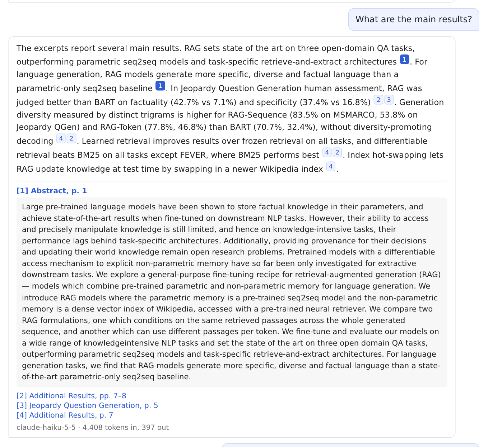
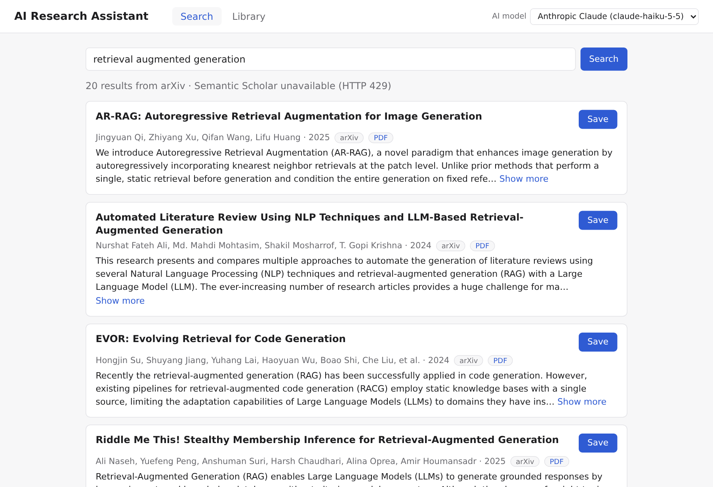
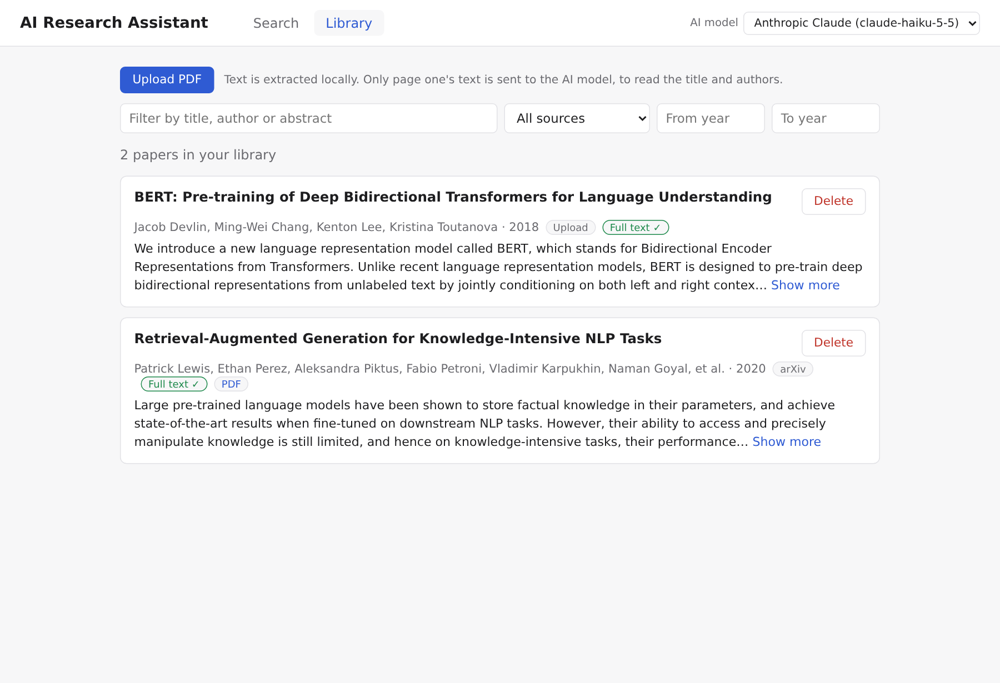
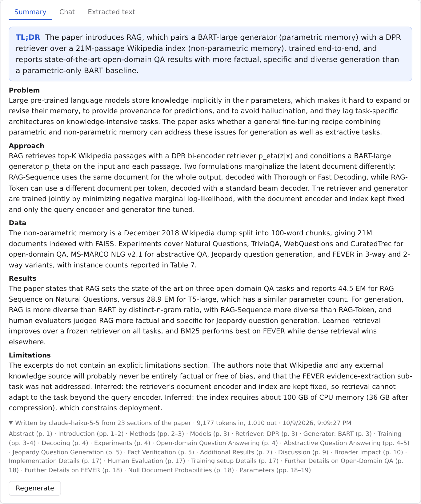
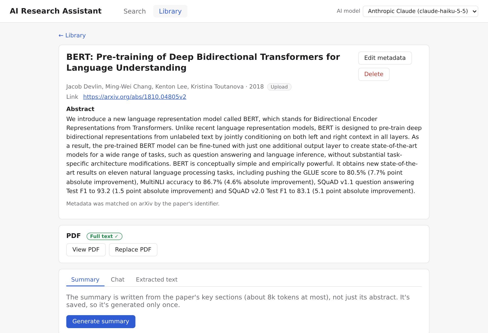

# AI Research Assistant

Search research papers, save them to a local library, upload your own PDFs, and ask an LLM to summarize a paper or answer questions about it. Summaries and answers are drawn from the paper's **full text**, not just its abstract, and every answer cites the passages it used.

The backend is FastAPI, the frontend is React (Vite), and data is stored in SQLite. Anthropic Claude and OpenAI are both supported, and you can switch between them in the app.



## Features

- **Search** papers by keyword or topic. The app queries Semantic Scholar and falls back to arXiv when Semantic Scholar is rate-limited or down. Each result shows the title, authors, year, abstract and a link.
- **Save** results to a local library that survives restarts and page refreshes. Duplicates are detected by DOI or Semantic Scholar ID, then by normalised title. You can filter the library by text, source and year.
- **Full text, automatically.** When a saved paper has an open-access PDF, the app downloads it in the background, extracts the text, splits it into sections and chunks, and embeds the chunks locally.
- **Upload PDFs.** The title, authors, year and abstract are read from the PDF itself and checked against Semantic Scholar and arXiv, so uploads look like search results. Every field stays editable. You can also attach a PDF to a saved paper that has no open-access copy.
- **Structured summaries** with TL;DR, Problem, Approach, Data, Results and Limitations sections. A summary is generated once and then cached.
- **Q&A chat** for each paper. Answers cite numbered passages, with section and page, and you can click a citation to read the passage. The conversation is saved.
- **Low token use.** Text extraction, chunking and embeddings all run on your machine. See [How token use is kept low](#how-token-use-is-kept-low).

## Requirements

- **Python 3.11 or newer.** Tested on 3.11 and 3.13.
- **Node.js 18 or newer.** Tested on 18 and 24.
- **An Anthropic or OpenAI API key** for summaries and Q&A. Without one, search, the library and PDF upload still work, and the AI features are switched off.
- Internet access for paper search, PDF downloads, the LLM, and a one-time download of the embedding model (about 65 MB).

## Quick start

These commands are for Linux and macOS. On Windows, see [the note below](#windows).

**1. Clone the repository.**

```bash
git clone https://github.com/andres9403/ai-research-assistant.git
cd ai-research-assistant
```

**2. Add your API key.**

```bash
cp .env.example .env
```

Open `.env` and set `ANTHROPIC_API_KEY` or `OPENAI_API_KEY`, or both. If you set only the OpenAI key, also set `LLM_PROVIDER=openai`. You can leave every other setting as it is.

**3. Start the backend** in its own terminal.

```bash
cd backend
python3 -m venv .venv
.venv/bin/pip install -r requirements.txt
.venv/bin/uvicorn app.main:app --port 8000
```

When you see `Application startup complete`, the backend is running. On first start it creates `data/` in the repo root, which holds the database, the PDFs and the embedding model.

**4. Start the frontend** in a second terminal.

```bash
cd frontend
npm install
npm run dev
```

**5. Open <http://localhost:5173>.** The header shows an **AI model** dropdown when a key is set, or **AI off: no LLM key** when none is.

To stop the app, press Ctrl+C in both terminals. Your library is kept in `data/` and is there again the next time you start it.

> `npm install` on npm 11 may warn that esbuild's install script was not run. You can ignore that warning; the app still builds and runs.

### Windows

Run the same steps in PowerShell, with these changes: use `python` instead of `python3`, `copy` instead of `cp`, and `.venv\Scripts\` instead of `.venv/bin/`.

```powershell
.venv\Scripts\pip install -r requirements.txt
.venv\Scripts\uvicorn app.main:app --port 8000
```

## Using the app

[docs/TUTORIAL.md](docs/TUTORIAL.md) walks through every feature step by step, and doubles as the script for the demo video. In short:

1. **Search.** Type a topic, such as `retrieval augmented generation`, and click **Save** on the papers you want.
2. **Library.** Saved papers show their PDF status: **Downloading PDF…**, then **Processing PDF…**, then **Full text ✓**. Click a title to open the paper. Use **Upload PDF** to add a paper from your own disk.
3. **Paper page → Summary.** Click **Generate summary**.
4. **Paper page → Chat.** Click one of the example questions or type your own. Click a citation number to see the passage it refers to.
5. **Paper page → Extracted text.** Shows exactly what the AI works from: the cleaned text, split into sections and chunks.

Use the **AI model** dropdown in the header to switch between Claude and OpenAI when both keys are set. The app remembers your choice in this browser.

| Search | Library |
|---|---|
|  |  |

| Summary | Uploaded PDF |
|---|---|
|  |  |

## How token use is kept low

The LLM never receives a whole paper. Each request is limited as follows.

| Step | What runs locally | What is sent to the LLM |
|---|---|---|
| PDF processing | PyMuPDF extracts the text, removes headers, footers and page numbers, finds section headings, drops references and acknowledgements, and splits sections into chunks of about 250 words | Nothing |
| Upload metadata | Heuristics read the PDF metadata and first-page layout | The first page's text only, capped at about 2k tokens |
| Embeddings | `fastembed` with `BAAI/bge-small-en-v1.5`, running on the CPU | Nothing |
| Summary | The sections are ranked: abstract, conclusion, introduction and results first, related work and appendices last | The top-ranked sections, about 8k tokens of paper text at most. The result is cached, so it is sent only once |
| Question | The question is embedded and compared with every chunk (NumPy cosine similarity) | The abstract, the start of the conclusion and the most relevant chunks, about 3k tokens at most, plus up to 1.5k tokens of recent conversation |

Token budgets are estimated at 3 characters per token, which holds for both Claude's and OpenAI's tokenizers. The instructions add a few hundred tokens to each request. Every summary and answer shows its own token counts, so you can see what each one cost. The default models are the cheap, fast tiers (`claude-haiku-5-5` and `gpt-5.4-mini`), and you can change them in `.env`.

## Architecture

```text
┌──────────────── React (Vite) frontend ────────────────┐
│  Search view │ Library view │ Paper detail view        │
│              │              │   ├─ Summary tab         │
│              │              │   ├─ Chat tab            │
│              │              │   └─ Extracted text tab  │
│  Header: LLM provider dropdown                         │
└───────────────────────────┬───────────────────────────┘
                            │ REST / JSON  (/api/*)
┌───────────────────────────▼───────────────────────────┐
│ FastAPI routers: search · papers · upload · ai ·       │
│                  settings · health                     │
├────────────────────────────────────────────────────────┤
│ Services                                               │
│  search     ────> Semantic Scholar API / arXiv API     │ (external)
│  pipeline   ────> download → PyMuPDF extract → clean → │
│                   section chunks → embed               │
│  metadata:  heuristics → LLM (1st page only)           │
│             → Semantic Scholar / arXiv lookup          │
│  retrieval  ────> fastembed vectors, NumPy cosine top-k│
│  summaries, chat ──> llm { Anthropic | OpenAI }        │ (external)
├────────────────────────────────────────────────────────┤
│ Storage: SQLite via SQLAlchemy                         │
│   papers · chunks · summaries · chat_messages          │
│   data/pdfs/ (PDF files)  data/models/ (embeddings)    │
└────────────────────────────────────────────────────────┘
```

Here is what happens behind each action:

1. **Search.** The app queries Semantic Scholar, falling back to arXiv. Results are normalised into cards and nothing is stored.
2. **Save.** The paper is checked for duplicates and stored. A background task downloads its open-access PDF, then extracts, cleans, chunks and embeds the text. The paper's status then becomes `ready`.
3. **Upload.** The PDF is stored and goes through the same extract, clean, chunk and embed steps. Its metadata is extracted and stays editable.
4. **Summary.** The highest-ranked sections, about 8k tokens at most, are sent to the selected LLM. The structured summary it returns is cached.
5. **Question.** The question is embedded and the most relevant chunks are retrieved. Those chunks and the recent conversation are sent to the LLM, which answers with numbered citations. Both the question and the answer are saved.

The design decisions behind this, and the alternatives that were considered, are recorded in [docs/PLANNING.md](docs/PLANNING.md).

## Configuration

All settings are read from `.env` in the repo root. Only an API key is needed.

| Setting | Default | Purpose |
|---|---|---|
| `ANTHROPIC_API_KEY`, `OPENAI_API_KEY` | none | At least one is needed for summaries, Q&A and the LLM metadata pass |
| `LLM_PROVIDER` | `anthropic` | The default provider, `anthropic` or `openai`. Users can switch in the header |
| `ANTHROPIC_MODEL`, `OPENAI_MODEL` | `claude-haiku-5-5`, `gpt-5.4-mini` | Model overrides |
| `LLM_TIMEOUT` | `90` | Seconds before an LLM request gives up |
| `SEMANTIC_SCHOLAR_API_KEY` | none | Raises Semantic Scholar's rate limits. Without a key, searches often fall back to arXiv |
| `DATA_DIR` | `data/` | Where the database, PDFs and embedding model are stored |
| `BACKEND_URL` | `http://localhost:8000` | Where the frontend dev server sends `/api` requests. Change it if the backend runs on another port |

Restart the backend after you change `.env`.

## API

Every route is under `/api`. While the backend is running, interactive documentation is available at <http://localhost:8000/docs>.

| Method and path | Purpose |
|---|---|
| `GET /api/health` | Backend and database check |
| `GET /api/search?q=&limit=` | Search Semantic Scholar, with arXiv as fallback |
| `GET /api/papers?q=&source=&year_from=&year_to=` | List and filter the library |
| `POST /api/papers` | Save a search result. Answers 409 if it is a duplicate |
| `GET`, `PATCH`, `DELETE /api/papers/{id}` | Read, edit or delete a paper |
| `POST /api/papers/upload` | Create a paper from an uploaded PDF |
| `POST /api/papers/{id}/pdf` | Attach or replace a saved paper's PDF |
| `GET /api/papers/{id}/pdf` | Download the stored PDF |
| `POST /api/papers/{id}/pdf/fetch` | Retry the open-access download |
| `GET /api/papers/{id}/chunks` | The extracted text chunks |
| `GET`, `POST /api/papers/{id}/summary` | Read the cached summary, or generate one (`?refresh=true` regenerates it) |
| `GET`, `POST`, `DELETE /api/papers/{id}/chat` | Read the conversation, ask a question, or clear the conversation |
| `GET /api/settings/llm` | The LLM providers that have keys, and the default |

## Project layout

```text
backend/
  app/
    main.py           FastAPI app and startup
    config.py         settings from .env
    models.py         SQLAlchemy tables
    routers/          one router per API area
    services/         business logic: search, pdf, pipeline, metadata,
                      embeddings, retrieval, llm, summaries, chat
  tests/              pytest suite; mocks the LLM and every external HTTP call
frontend/
  src/
    views/            Search, Library, Paper detail
    components/       paper card, summary and chat panels, upload button
docs/
  PLANNING.md         design decisions and milestones
  TUTORIAL.md         step-by-step walkthrough and demo-video script
data/                 created at runtime, git-ignored
```

## Running the tests

```bash
cd backend
.venv/bin/python -m pytest -q
```

The suite uses a temporary data directory and mocks the LLM providers, the embedding model and all external HTTP calls, so it needs no API keys or network access.

To check that the frontend compiles, run `npm run build` from `frontend/`.

## Troubleshooting

| Symptom | Fix |
|---|---|
| The header says **backend unreachable** | Start the backend (step 3) on port 8000, or set `BACKEND_URL` if it runs on a different port. Then reload the page |
| The header says **AI off: no LLM key** | Add a key to `.env` and restart the backend |
| Search says *Semantic Scholar unavailable (HTTP 429)* | Semantic Scholar is rate-limiting keyless requests. The results come from arXiv instead. Add `SEMANTIC_SCHOLAR_API_KEY` to avoid this |
| A paper shows **No PDF** | It has no open-access copy. Open the paper and use **Upload PDF** to attach one |
| A paper shows **PDF unreadable** | The PDF has no extractable text, for example because it is a scan. Try a different copy |
| The first question takes several seconds | The embedding model is downloaded the first time it is used, about 65 MB. A warning about `HF_TOKEN` in the backend log is harmless |
| Port 8000 or 5173 is already in use | Run the backend with `--port 8001` and set `BACKEND_URL=http://localhost:8001` in `.env`. Vite picks the next free port by itself |

## License

[MIT](LICENSE)
